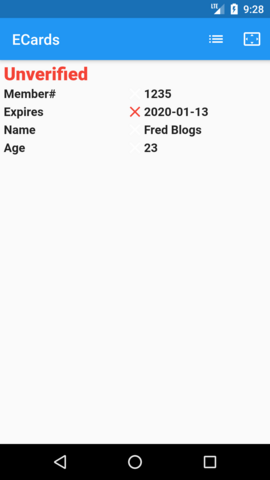

# ECard - Electronic Club Membership Cards

ECards are digitally signed QR Codes for club membership cards. They are digitally signed, so they can be scanned for verification using the ECard Android or iPhone app.

**Note:** Binaries for the ecard command line app can be found under [Releases](https://github.com/philseeley/ecard/releases).

## Generating Public/Private Key Pairs

To create an ECard, first you must create a public/private key pair using the **ecard genkeys** command:
```
Generates public/private key pairs

Usage: ecard genkeys [arguments]
-h, --help                  Print this usage information.
    --stamp=<image file>    the stamp image to use

Run "ecard help" to see global options.

Where arguments are:
  <organisation name> the name of the organisation the keys are for.
  <key file>          the file to store the generated keys in.
```
For example to save the key pair to myclub.keys:
```
ecard genkeys --stamp myclub-logo.png "My Club" myclub.keys
```
The stamp image is added to all issued ecards and shown when a QR Code if verified. Use an image approximately 64x64 pixels.

## Generate Signed QR Code ECards

Once you have your keys, you can issue ecards. The data in an ecard consists of name/value pairs, one per line and separated by a ":". Any names and values can be used, but special processing is performed if the name represents a date in the form **YYYY-MM-DD** and the card is considered expired if the value is **"Expires"**. For example the file **joe-blogs.txt** could contain:
```
Member#:1234
2021-08-21:Expires
Name:Joe Blogs
Age:25
2020-02-05:Club Coach
```
This card expires on the 21st of Aug 2021 and Joe's Club Coach rating is valid until the 5th of Feb 2020.

The ecard can then be created using the **ecard signqr** command:
```
Generates a signed QR code

Usage: ecard signqr [arguments]
-h, --help                  Print this usage information.
    --stamp=<image file>    the stamp image to use
    --png=<filename>        the output PNG filename - defaults to <data file>.png
    --ecard=<filename>      the output ECard filename - defaults to <data file>.ecard

Run "ecard help" to see global options.

Where arguments are:
  <key file>    the name of the key file.
  <data file>   the name of the file contaning the data to sign.
```
For example:
```
ecard signqr myclub.keys joe-blogs.txt
```
This will produce 2 files, **joe-blogs.ecard** and **joe-blogs.png**. The **.png** can be used on its own as a membership card, either stored on a phone or printed:


## Verifying with the ECard Phone App

The **.ecard** can be loaded into the ECard phone app for display, but also to enable you to scan and verify other ecards issued by your club.

**Note:** you must load an **.ecard** into the phone app in order to verify QR Codes for that club.

After receiving your **.ecard** by email, save it to your phone and then load it into the ECard app through the  and  buttons. If you have added than one ECard, you can select which ECard is displayed when the app is opened:


Selecting the imported ECard will display its QR Code and if you press and hold the QR Code its data will be displayed, with any expired items marked with an **X**:

 

Once you have loaded an **.ecard** into the app, you can then use the  button to scan and verify other QR Codes:

 

An **Expired** result indicates that the signature was correctly verified, but the ECard has expired. An **Unverified** result indicates that either no signature was found or the data has been modified since the ECard was issued.
